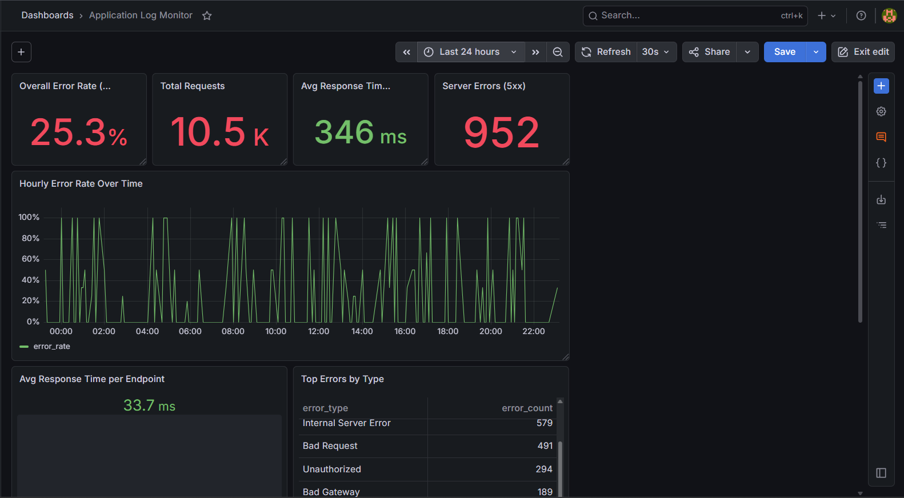

# 🚀 Application Log Monitor & Alert Dashboard


A production-style **log monitoring and observability system** that simulates application logs, processes them through an ETL pipeline, stores them in PostgreSQL, performs SQL-based analytics, triggers threshold-based alerts, and visualizes system health via Grafana dashboards.

---

## 🛠️ Tech Stack

| Layer          | Tool / Technology                               |
| -------------- | ----------------------------------------------- |
| Log Generation | Python (Faker, CSV)                             |
| Database       | PostgreSQL 15                                   |
| Analytics      | SQL (CTEs, Window Functions, `PERCENTILE_CONT`) |
| Alerting       | Python (psycopg2)                               |
| Dashboard      | Grafana                                         |
| Infrastructure | Docker + Docker Compose                         |

---

## 📂 Project Structure

```bash
log_monitor/
├── log_generator.py       # Generates 10K+ synthetic logs
├── db_setup.py            # Loads logs into PostgreSQL
├── queries.sql            # SQL analytics queries
├── alerting.py            # Alert engine (threshold-based)
├── grafana_dashboard.json # Dashboard config
├── docker-compose.yml     # Services setup
└── grafana_provisioning/  # Datasource config
```

---

## ⚙️ Setup Instructions

### 1️⃣ Start Services

```bash
docker compose up -d
```

* PostgreSQL → `localhost:5432`
* Grafana → http://localhost:3000
  Login: `admin / admin`

---

### 2️⃣ Install Dependencies

```bash
pip install faker psycopg2-binary pandas
```

---

### 3️⃣ Generate Logs

```bash
python log_generator.py
```

* Generates `app_logs.csv`
* ~10,500 records across 30 days
* Includes simulated **error spikes**

---

### 4️⃣ Load Data

```bash
python db_setup.py
```

* Creates schema + indexes
* Loads data into PostgreSQL

---

### 5️⃣ Run Alert Engine

```bash
python alerting.py
```

or continuous mode:

```bash
python alerting.py --watch 60
```

---

### 6️⃣ Setup Grafana Dashboard

* Open → http://localhost:3000
* Go to → **Connections → Data Sources**

#### Add PostgreSQL:

* Host → `postgres:5432`
* Database → `log_monitor`
* User → `postgres`
* Password → `postgres`
* SSL → Disable

#### Import Dashboard:

* Go to → Dashboards → Import
* Upload → `grafana_dashboard.json`

---

## 📊 Dashboard Metrics

* 📈 Total Requests
* ⚠️ Error Rate (%)
* ⚡ Avg Response Time
* 🚨 Server Errors (5xx)
* 📊 Endpoint Performance
* 📉 Error Trends

---

## 📸 Screenshots

<p align="center">
  
</p>

---

## 📊 SQL Queries Overview

| # | Query                 | Technique            |
| - | --------------------- | -------------------- |
| 1 | Error rate            | CASE + Aggregate     |
| 2 | Endpoint errors       | GROUP BY             |
| 3 | P95/P99 latency       | `PERCENTILE_CONT`    |
| 4 | Spike detection       | CTE + STDDEV         |
| 5 | Top failing endpoints | Filtered aggregation |
| 6 | Daily trends          | `DATE_TRUNC`         |
| 7 | Slow requests         | Window functions     |
| 8 | Error breakdown       | Percentage share     |

---

## 🚨 Alert Rules

| Rule               | Threshold | Severity    |
| ------------------ | --------- | ----------- |
| High Error Rate    | > 5%      | 🚨 CRITICAL |
| High Latency (P95) | > 1000 ms | ⚠️ WARNING  |
| Server Error Spike | > 10      | 🚨 CRITICAL |

---

## 🧠 Key Design Decisions

* **Synthetic error spike** → Enables realistic anomaly detection
* **P95/P99 metrics** → Industry-standard (better than average)
* **Polling alert engine** → Similar to Splunk alerts
* **Indexed columns** → Optimized for performance

---

## 💡 Use Cases

* Application monitoring
* Backend observability
* Error tracking systems
* DevOps dashboards

---

## 🚀 Future Improvements

* Kafka streaming pipeline
* Prometheus integration
* Email/SMS alerts
* Cloud deployment

---

## 👨‍💻 Author

**Akash Masane**

---

## ⭐ Support

If you found this useful, give it a ⭐ on GitHub!
